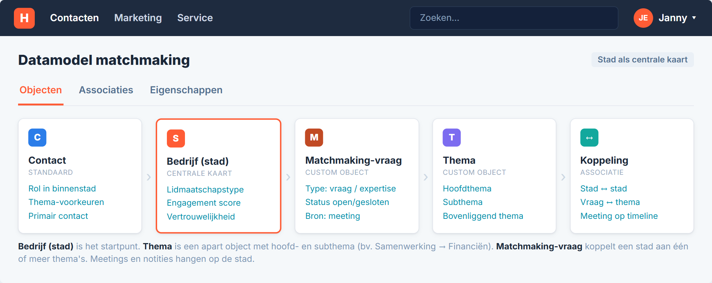
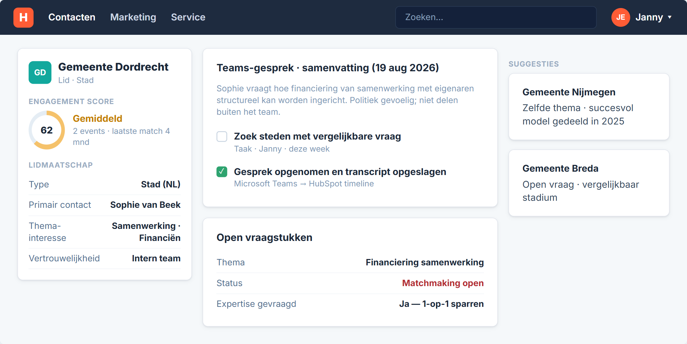
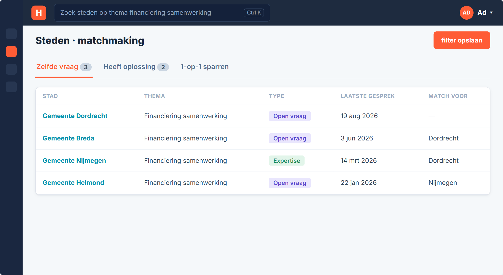
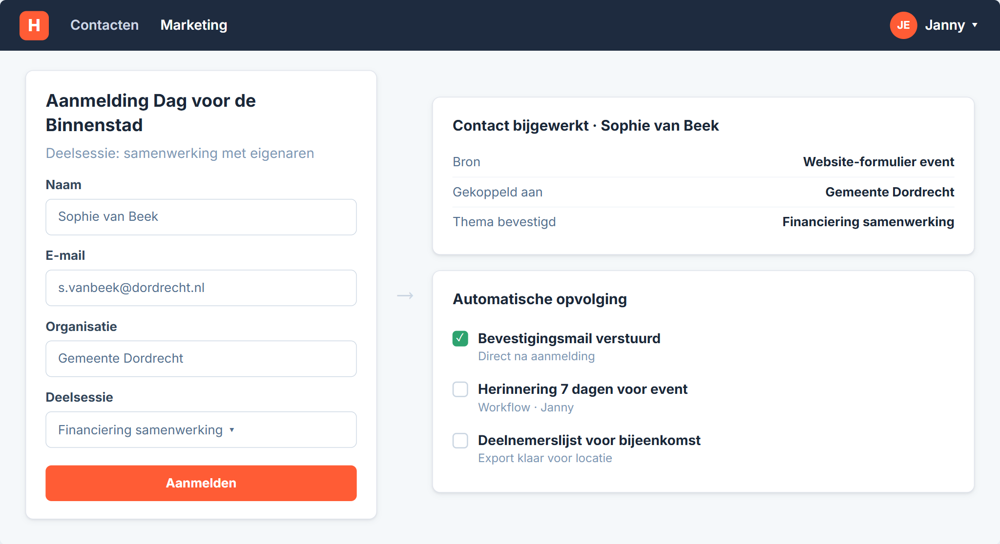
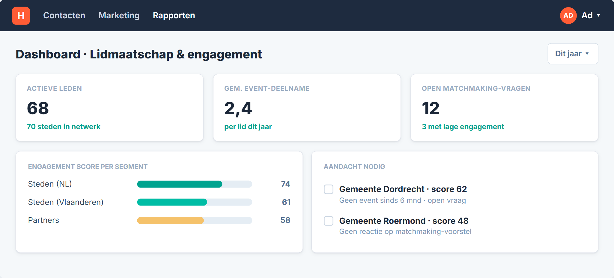

# Eén stad. Eén verhaal.

We volgen **Gemeente Dordrecht**. Sophie van Beek is contactpersoon binnenstad. Ze heeft een vraag over financiering van samenwerking met eigenaren — een thema dat in meer steden speelt.

Het uitvoerend team van Platform Binnenstadsmanagement faciliteert de koppeling. Jullie blijven tussen de steden staan. HubSpot helpt om gesprekken, thema's en vervolgacties op één plek vast te leggen.

Dit document loopt dat verhaal door. Daarna openen we HubSpot en klikken we dezelfde stappen.

---

# Jouw situatie

Platform Binnenstadsmanagement verbindt circa 70 binnensteden in Nederland en Vlaanderen met partners en kennisinstellingen. Het uitvoerend team (Ad, Janny en Marlon) werkt parttime. Leden betalen een lidmaatschap; jullie leveren onder meer bijeenkomsten, de Binnenstadsbarometer, matchmaking en inspiratie.

De shift gaat van grote massabijeenkomsten naar één-op-één kennisdeling. Daarbij komt veel informatie vrij uit gesprekken met steden. Die data staat nu verspreid over Excel, Teams, e-mail, MailChimp en City Connect.

**Tools vandaag:** Microsoft Outlook & Teams · Excel · City Connect · MailChimp · Twinfield (via administratiekantoor) · LinkedIn & website

**Wat nu lastig is**

- Gespreksinformatie en matchmaking zitten in losse lijsten en systemen
- Geen centraal overzicht wie wat heeft afgesproken met welke stad
- Open vragen uit gesprekken worden soms te laat opgepakt
- Event-aanmeldingen en nieuwsbrief lopen via losse kanalen
- Weinig zicht op hoe actief elk lidmaatschap is
- Kleine ploeg — het systeem moet ontzorgen, niet extra werk geven

---

# Scenario 1 — Matchmaking na een stadsgesprek

## De reis

<table style="width:100%; border-collapse:collapse; font-size:9pt; margin:12pt 0;">
<tr>
<td style="background:#FF4B0F; color:white; padding:8pt 4pt; text-align:center; border-radius:4pt 0 0 4pt;">Teams-gesprek</td>
<td style="background:#FF4B0F; color:white; padding:8pt 4pt; text-align:center;">Verslag in HubSpot</td>
<td style="background:#FF4B0F; color:white; padding:8pt 4pt; text-align:center;">Thema taggen</td>
<td style="background:#FF4B0F; color:white; padding:8pt 4pt; text-align:center;">Zoeken op match</td>
<td style="background:#363a44; color:white; padding:8pt 4pt; text-align:center; border-radius:0 4pt 4pt 0;">Jullie faciliteren intro</td>
</tr>
</table>

## Wat gebeurt er

Sophie bespreekt in Teams een gevoelige vraag over financiering van samenwerking met eigenaren. Het gesprek wordt opgenomen en komt op het record van Gemeente Dordrecht. HubSpot maakt een samenvatting met actiepunten.

Janny tagt het thema en legt vast dat de vraag vertrouwelijk is. Ze zoekt welke andere steden dezelfde vraag hebben of daar al ervaring mee hebben — bijvoorbeeld Nijmegen of Breda. Ad of Janny neemt contact op om een koppeling te regelen. Steden zien elkaars data niet zelf.

## Het datamodel

Matchmaking bouwt op een eenvoudig datamodel. **Bedrijf** staat voor de stad of organisatie. **Contact** zijn de personen binnen die stad. Op het stad-record hangen meetings, notities en taken.

Twee custom objects maken matchmaking schaalbaar:

| Object | Rol |
|---|---|
| **Thema** | Jullie taxonomie: hoofdthema (bv. Samenwerking) en subthema (bv. Financiën). Elk thema is een vast record, niet een losse tag. |
| **Matchmaking-vraag** | Eén concrete vraag of expertise van een stad, gekoppeld aan thema's en aan de stad. Status: open, in behandeling of afgerond. |

Een stad kan meerdere matchmaking-vragen hebben. Een vraag kan aan meerdere thema's hangen. Zo blijft zoeken consistent — ook als de taxonomie later groeit.

## Werkwijze: handmatig en via Breeze

**Handmatig (altijd mogelijk)**

Janny opent het stad-record na een gesprek. Ze maakt een matchmaking-vraag aan, kiest het juiste **Thema** uit de lijst en zet status op *open*. Vertrouwelijkheid en een korte samenvatting vult ze zelf in. Daarna opent ze een lijst op hetzelfde thema om matches te zoeken.

**Automatisch via Breeze (met review)**

Na een Teams-gesprek doet Breeze drie dingen op basis van het transcript:

1. **Samenvatting** op de timeline van de stad — wie sprak, wat was de kernvraag, welke actiepunten.
2. **Thema-voorstel** — Breeze suggereert het passende Thema-record (bv. Samenwerking → Financiën). Janny bevestigt of past aan.
3. **Matchmaking-vraag-voorstel** — Breeze stelt voor om een vraag-record aan te maken met type *zoekt hulp* of *kan expertise delen*. Janny reviewt en slaat op.

Breeze vult dus het voorwerk in. Jullie team controleert altijd voordat iets definitief wordt — zeker bij vertrouwelijke vragen. Geen automatische koppeling tussen steden zonder menselijke goedkeuring.

## Nu → Straks

| Nu | Straks |
|---|---|
| Gespreksverslag in Excel, verspreid over mappen | Gesprek en samenvatting op het stad-record in HubSpot |
| Handmatig zoeken wie hetzelfde vraagstuk heeft | Filter op thema: open vraag vs. beschikbare expertise |
| Context zit in het hoofd van collega's | Collega ziet direct wat er besproken is en wat openstaat |

## Stap voor stap

| # | Actie | Wie |
|---|---|---|
| 1 | Teams-gesprek met Sophie van Beek (Gemeente Dordrecht) | Ad / Janny |
| 2 | Transcript en samenvatting op company-record | HubSpot + Teams |
| 3 | Thema en vertrouwelijkheid vastleggen | Janny |
| 4 | Lijst met steden op zelfde thema openen | Janny |
| 5 | Match faciliteren tussen Dordrecht en Nijmegen | Ad |

# Scenario 2 — Event-aanmelding en gerichte uitnodiging

## De reis

<table style="width:100%; border-collapse:collapse; font-size:9pt; margin:12pt 0;">
<tr>
<td style="background:#FF4B0F; color:white; padding:8pt 4pt; text-align:center; border-radius:4pt 0 0 4pt;">Event op website</td>
<td style="background:#FF4B0F; color:white; padding:8pt 4pt; text-align:center;">Aanmelding in HubSpot</td>
<td style="background:#FF4B0F; color:white; padding:8pt 4pt; text-align:center;">Bevestiging</td>
<td style="background:#FF4B0F; color:white; padding:8pt 4pt; text-align:center;">Herinnering</td>
<td style="background:#363a44; color:white; padding:8pt 4pt; text-align:center; border-radius:0 4pt 4pt 0;">Deelnemerslijst klaar</td>
</tr>
</table>

## Wat gebeurt er

De Dag voor de Binnenstad heeft een deelsessie over samenwerking met eigenaren. Sophie meldt zich aan via het formulier op jullie website. Haar contact en organisatie komen direct in HubSpot. Ze hoort dezelfde dag een bevestiging.

Een week voor het event krijgt ze een herinnering. Janny trekt met één klik een deelnemerslijst voor de locatie. Steden die eerder interesse toonden in dit thema kunnen proactief worden uitgenodigd — zonder handmatig in Excel te zoeken.

## Nu → Straks

| Nu | Straks |
|---|---|
| Aanmelding via website, opvolging handmatig | Formulier vult contact en stad automatisch aan |
| Bevestiging en herinnering los versturen | Workflow stuurt mails op vaste momenten |
| Deelnemerslijst zelf bijhouden | Lijst en export uit één systeem |
| Uitnodiging op thema kost veel zoekwerk | Segment op thema-interesse per contact |

## Stap voor stap

| # | Actie | Wie |
|---|---|---|
| 1 | Sophie meldt zich aan voor deelsessie op de website | Sophie |
| 2 | Contact gekoppeld aan Gemeente Dordrecht | HubSpot |
| 3 | Bevestigingsmail automatisch verstuurd | Workflow |
| 4 | Herinnering 7 dagen voor het event | Workflow |
| 5 | Deelnemerslijst exporteren voor de bijeenkomst | Janny |

# Scenario 3 — Engagement per lidmaatschap

## De reis

<table style="width:100%; border-collapse:collapse; font-size:9pt; margin:12pt 0;">
<tr>
<td style="background:#363a44; color:white; padding:8pt 4pt; text-align:center; border-radius:4pt 0 0 4pt;">Data verzamelen</td>
<td style="background:#FF4B0F; color:white; padding:8pt 4pt; text-align:center;">Score berekenen</td>
<td style="background:#FF4B0F; color:white; padding:8pt 4pt; text-align:center;">Signaal bij daling</td>
<td style="background:#FF4B0F; color:white; padding:8pt 4pt; text-align:center;">Taak aan team</td>
<td style="background:#363a44; color:white; padding:8pt 4pt; text-align:center; border-radius:0 4pt 4pt 0;">Proactief contact</td>
</tr>
</table>

## Wat gebeurt er

HubSpot combineert signalen per stad: event-deelname, e-mailreacties, matchmaking-contact en openstaande vragen. Gemeente Dordrecht scoort gemiddeld — Sophie heeft een open vraag en was lang niet op een bijeenkomst.

Janny krijgt een taak om contact op te nemen. Zo voorkom je dat een lid het gevoel krijgt dat jullie niet meer reageren. Het bestuur ziet in één dashboard welke steden extra aandacht nodig hebben.

## Nu → Straks

| Nu | Straks |
|---|---|
| Geen overzicht hoe actief een lid is | Engagement score per stad in HubSpot |
| Open vragen in Excel of mail | Taken en signalen op het stad-record |
| Proactief contact op gevoel | Dashboard toont welke steden aandacht nodig hebben |
| Rapportages handmatig samenstellen | Vaste rapporten over deelname en matchmaking |

## Stap voor stap

| # | Actie | Wie |
|---|---|---|
| 1 | HubSpot berekent engagement op basis van events, mail en gesprekken | HubSpot |
| 2 | Dordrecht scoort onder drempel — taak voor Janny | Workflow |
| 3 | Janny belt Sophie over open vraag en komende sessie | Janny |
| 4 | Bestuur bekijkt dashboard met steden die aandacht nodig hebben | Ad |
| 5 | Vervolg: matchmaking afronden en score laten stijgen | Team |

**Aanname tot we bevestigen:** de volledige Customer Success Workspace vereist Service Hub Enterprise. In de demo tonen we het principe via engagement score en taken op company-records.

# Daarna openen we HubSpot

Het verhaal hierboven is de use case. In de portal klikken we dezelfde stappen.

| # | In de portal | Scenario |
|---|---|---|
| 1 | Company-record Gemeente Dordrecht openen | 1 |
| 2 | Meeting op timeline + samenvatting bekijken | 1 |
| 3 | Datamodel: Thema + Matchmaking-vraag als custom objects | 1 |
| 4 | Lijst/filter op thema financiering samenwerking | 1 |
| 5 | Event-formulier op website + testinzending | 2 |
| 6 | Workflow bevestiging en herinnering tonen | 2 |
| 7 | Engagement score op company-record | 3 |
| 8 | Dashboard lidmaatschap en event-deelname | 3 |
| 9 | Taak bij openstaande vraag of lage score | 1, 3 |

**Later:** koppeling met City Connect, volledig ledenportaal en Twinfield vallen buiten de eerste fase. We bespreken die stappen in het implementatieplan.

## Wat we nog van jullie nodig hebben

1. Wie beslist formeel tussen HubSpot en Dynamics — en op welke criteria?
2. Hebben jullie de thema-taxonomie voor matchmaking al op papier staan?
3. Hoeveel HubSpot-gebruikers worden het: alleen het uitvoerend team of ook bestuursleden?
